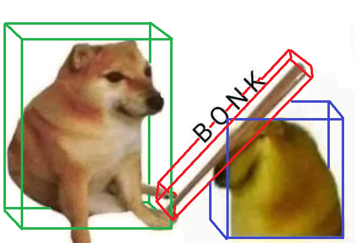

    
     
     

# Bonk!

Simple 3D game collision library for Jai.

This is intended to be an extension of the `Math` module from Jai's standard library, adding math that is commonly used in continuous collision detection.
It will not have any dependencies outside of the standard library.

This is NOT a full physics engine. Instead, it is the math and building blocks required for implementing *simple* physics, suitable for *most* games.
It is not designed for ultra-realistic physics simulations.

That being said, if you are making a physically realistic game, you could still utilize the math and data structures from this library.

### Primary goals:

- Shapes
    - Line
    - Plane
    - Triangle
    - Polygon
    - Box
    - Sphere
    - Cylinder
    - Capsule
    - Cone
    - Heightfield
    - TriMesh
- Bounding Volumes
    - AABB
    - Bounding Sphere
    - BVH
- Intersection tests
- Raycasts
- Sweep tests
- Point Projection
- Distance Computation
- Convex Hulls and Decompositions
- Spatial Partitioning
    - BSP Tree
    - Octree
    - K-d tree
